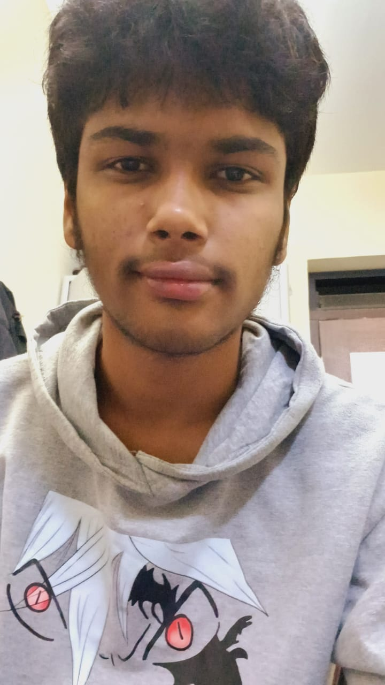

# Annepu Sai Devesh
******
## About Me
I'm Annepu Sai Devesh

I'm 18 yrs old and I enjoy coding. I am pursuing Btech CSE in IIT Goa currently. I aspire to become one of the best in the field of technology. I learned python fist when i was 16 in my school. I enjoyed using python and liked logical based problems the most. Ever since then I had a keen interest on coding and also learned C++. Even though I am a beginner... I wish to have a fun and exciting journey.
******
## Education

| Academic yr | Standard | School |
| ----------- | ----------- | ----------- |
| 2020 | 10 | Devi Academy |
| 2022 | 12 | Devi Academy |

## Course @IIT goa
- **CS 102** Software tools *Clint P.George* [cs102 software tools](https://clintpgeorge.github.io/cs-102/spring-2023/)
- **MA 103** ODE *Soumya Bajbai*
- **Ph102** Magnetism *Santhosh Kumar*
- **EE101** Electronics *Dr. Bishan*
- **BIO 101** Biology *Nipa*
- **ME102** Mechanical *Arindam*
******

## Hobbies and Interests
I love and enojy playing badminton. I play badminton professionally too. I enjoy playing baskletball yoo. I loved coding since I was 16 yrs old. In my free time I like to eat food, sleep and bionge on netflix.
******

